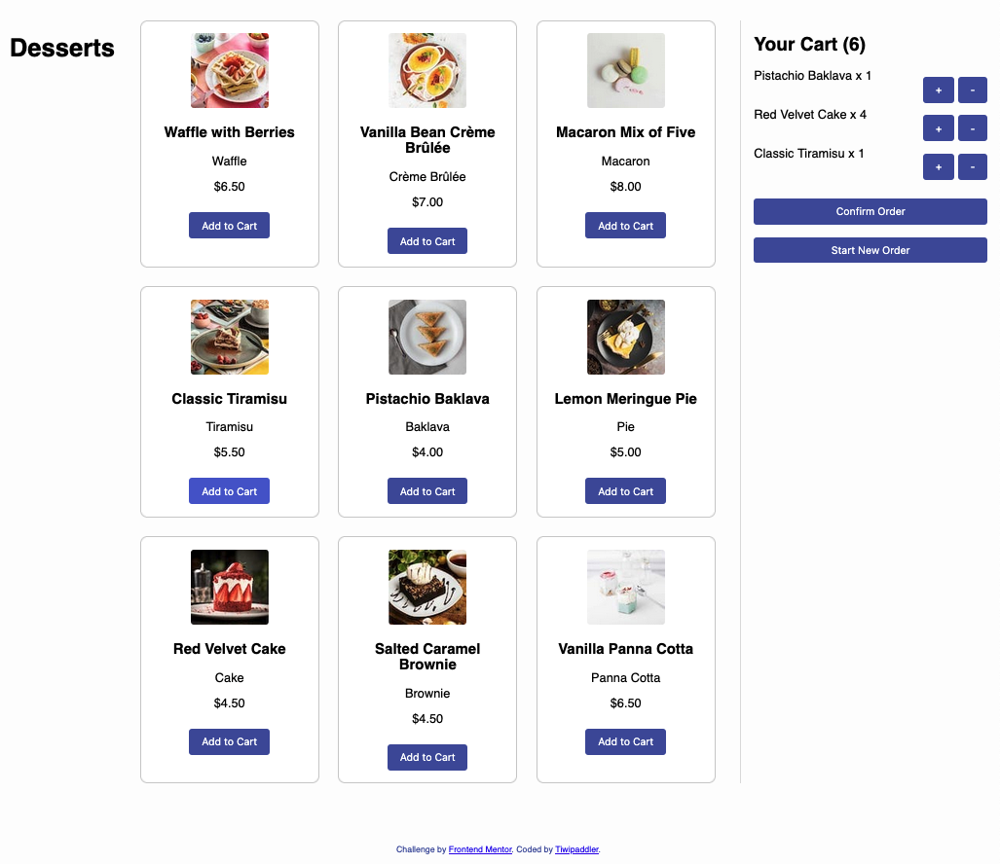

# Frontend Mentor - Product list with cart solution

This is a solution to the [Product list with cart challenge on Frontend Mentor](https://www.frontendmentor.io/challenges/product-list-with-cart-5MmqLVAp_d). Frontend Mentor challenges help you improve your coding skills by building realistic projects. 

## Overview

### The challenge

Users should be able to:

- Add items to the cart and remove them
- Increase/decrease the number of items in the cart
- See an order confirmation modal when they click "Confirm Order"
- Reset their selections when they click "Start New Order"
- View the optimal layout for the interface depending on their device's screen size
- See hover and focus states for all interactive elements on the page

### Screenshot




### Links

- Live Site URL: [Vercel site URL here](https://product-list-with-cart-main-12xl0yqo6-tiwipaddlers-projects.vercel.app/)


### What I learned

One of the main lessons I learned in this project is how **CSS specificity** and the **order of declarations** affect the visibility of elements on the page. 

Initially, my modal appeared even though it had the `.hidden` class. This was because the `#modal` rule set `display: flex`, and the `.hidden` class with `display: none` wasn't specific enough to override it.

To fix this, I learned to **increase the specificity** of the CSS rule so that it properly hides the modal:

```css
#modal.hidden {
  display: none;
}
```
🎯
**Takeaway**: When debugging UI behavior, don't just check your JavaScript — always verify how your CSS rules are being applied and whether specificity or rule order is affecting the outcome.


## Author

- Twitter - [@tiwipaddler](https://www.twitter.com/tiwipaddler)


